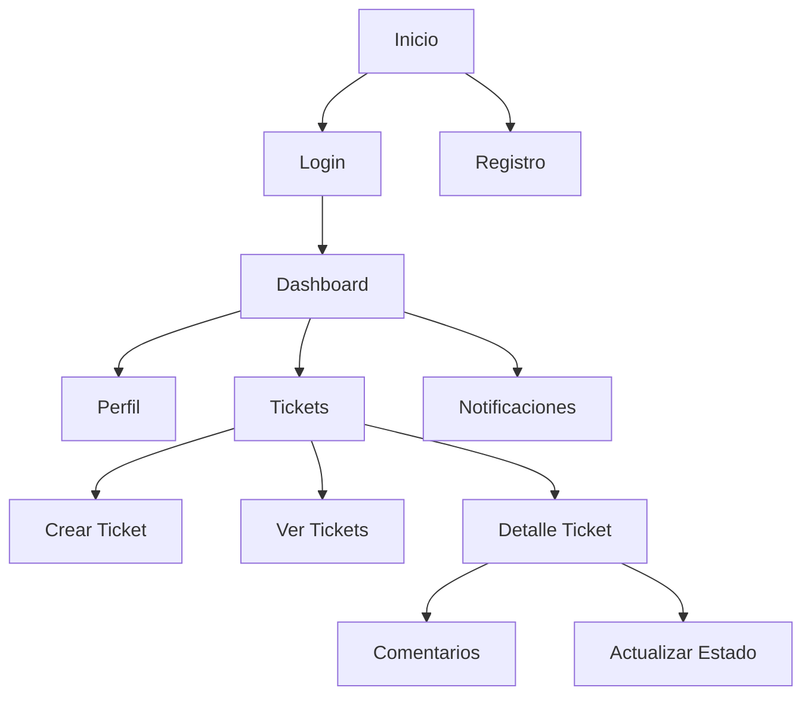
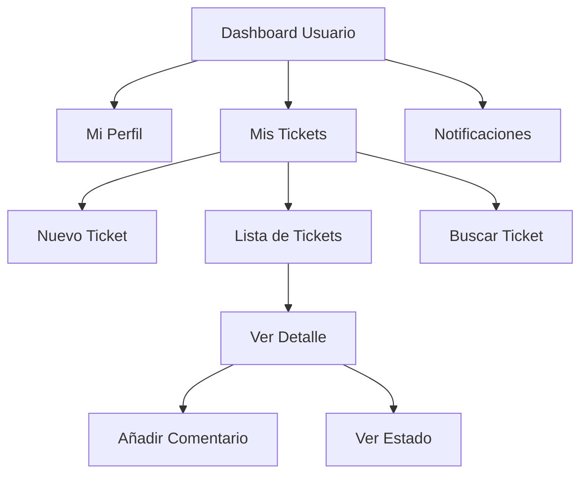
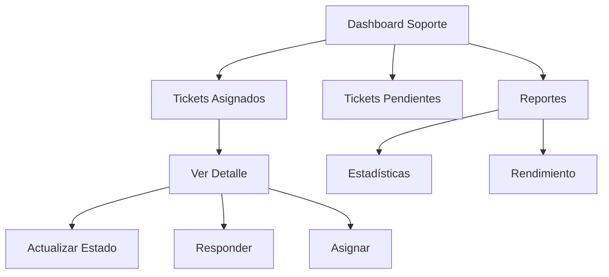
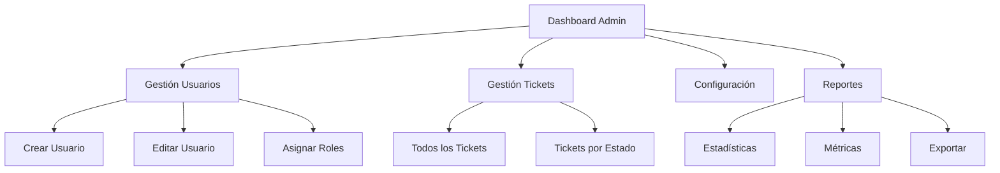
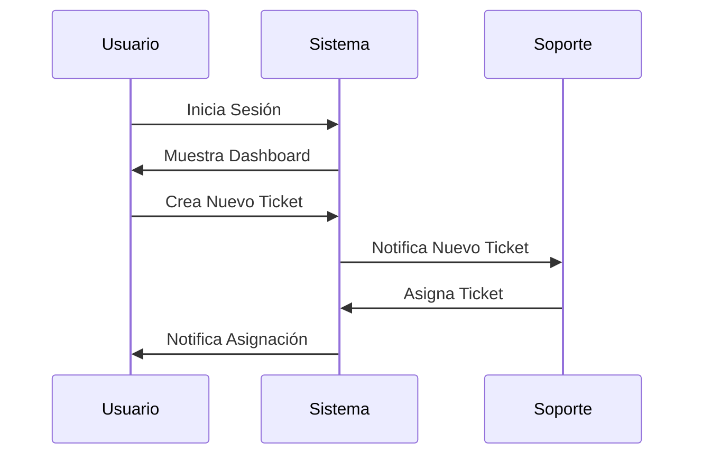
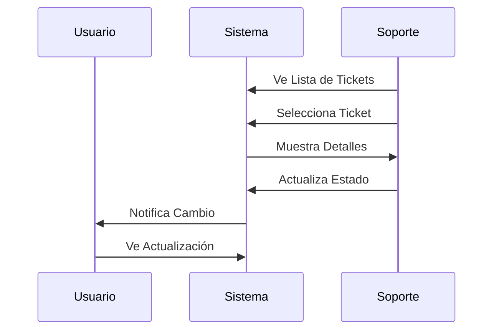
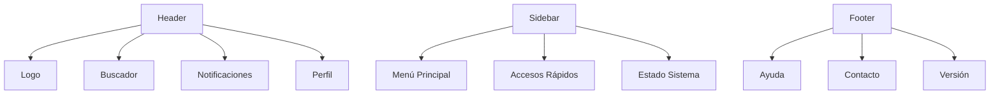

# Mapas de Navegación - Sistema de Mesa de Ayuda

## Estructura General

## Navegación por Rol - Usuario Normal

## Navegación por Rol - Soporte

## Navegación por Rol - Administrador

## Flujo de Creación de Ticket

## Flujo de Atención de Ticket

## Elementos de Navegación Persistentes

Para visualizar estos diagramas:
1. Abra este archivo con un editor que soporte Mermaid (como VS Code con la extensión Mermaid)
2. O copie el contenido de cada diagrama en un visualizador online de Mermaid
3. También puede usar herramientas como Mermaid Live Editor para convertirlos a imágenes PNG/SVG 